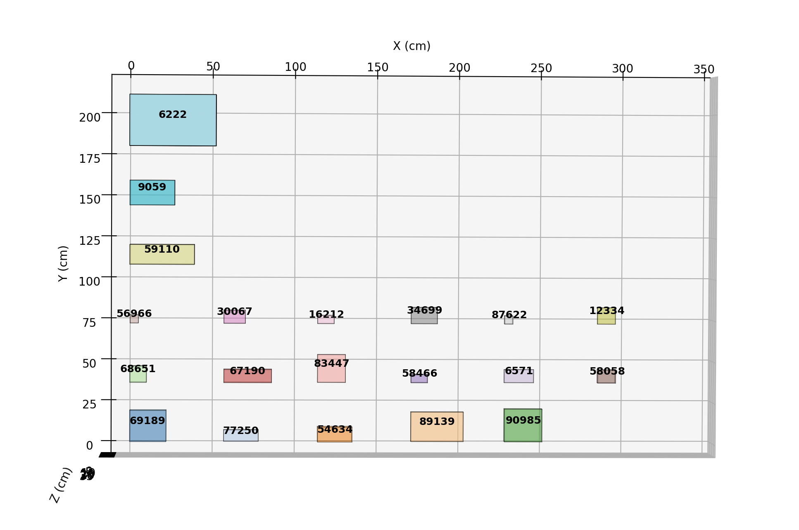
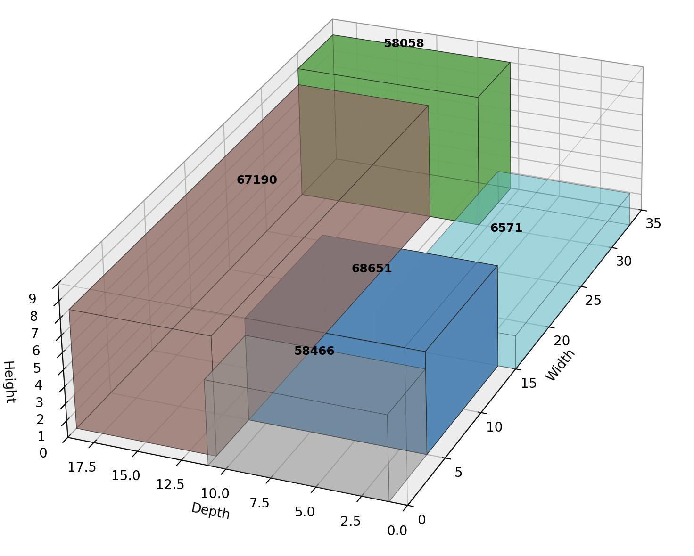

# 3D Packing

A MILP-based pipeline for optimizing e-commerce order packaging. Given a transaction (a set of products with dimensions and weights aka an Order), the system assigns products to shipping boxes and computes a physically stable 3D arrangement — all within a hard real-time budget of a few seconds.

This is a small part of a bigger project our university group of 15 People was working on for 3+ Months. The original project solved a wider scope of NP Problems and their extensions. This repository exclusively contains my contribution to the project.

## Pipeline

The solution runs three sequential optimization models:

1. **Transaction splitting (MILP)** — splits the order into sub-transactions using a bin-packing formulation. Enforces a 10 kg weight limit per box and separates incompatible product pairs (weight ratio ≥ 5×) to prevent damage.

2. **Box selection (MILP)** — for each sub-transaction, jointly selects a box type from the available catalog and produces a geometrically valid 3D packing with full non-overlap constraints, a cardinality limit (≤ 7 products per box), and a minimum fill rate of 50%.

3. **Packing quality (MIQP)** — refines the arrangement from step 2 using a non-convex mixed-integer quadratic program. The objective is a weighted sum of four physical quality terms: **flatness** (products lie on their largest face), **pyramid** (wider products lower in the box), **gravity** (heavier products lower), and **fragility** (heavy products must not rest on light ones).

The box-selection solution is used as a warm start for the quality step, which cuts solve time to under 0.1 s per sub-transaction on typical hardware.

## Example

Transaction splitting result — products grouped into feasible sub-transactions:



Final quality-optimized packing for one sub-transaction:



## Documentation

Full MILP/MIQP formulations are in [`doc/milps.tex`](doc/milps.tex) (compiled: [`doc/milps.pdf`](doc/milps.pdf)).

## Usage

```bash
pip install .
```

```
optimize_3d [-h] [--products PRODUCTS] [--start START] [--cartons CARTONS] filename

positional arguments:
  filename              JSON file with orders (output of gen_orders.py)

options:
  --products, -p        CSV file with product definitions (default: products.csv)
  --start, -s           From which order in the filename to start with
  --cartons, -c         JSON file with available carton (box) definitions
```

When `--cartons` is provided the pipeline runs box selection against the fixed catalog; otherwise it optimizes box dimensions freely. Results are displayed as an interactive 3D visualization.
